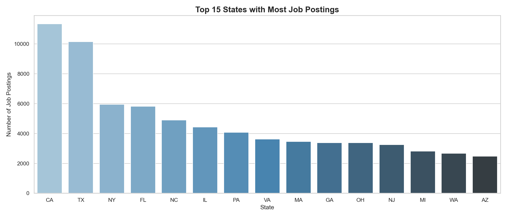
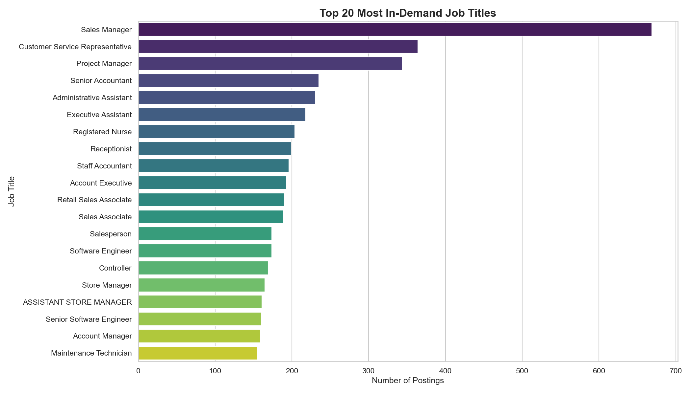
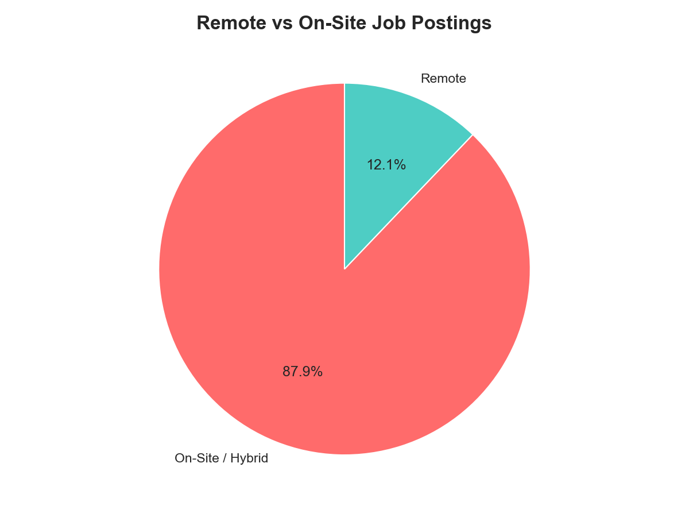
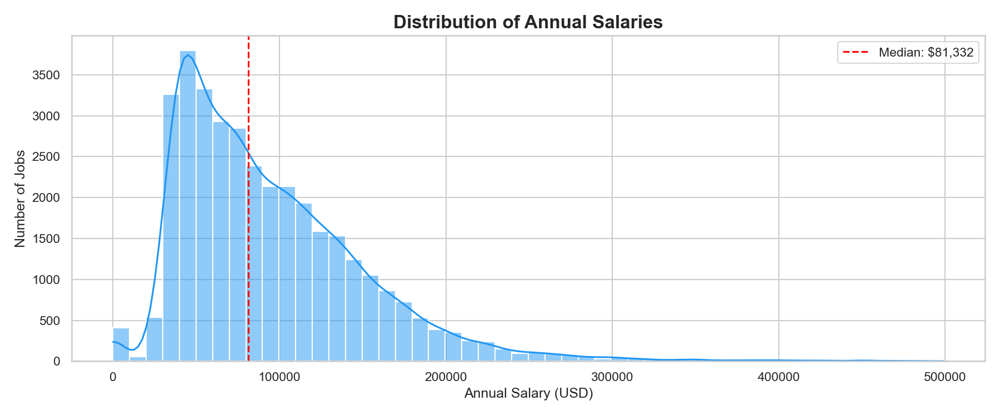
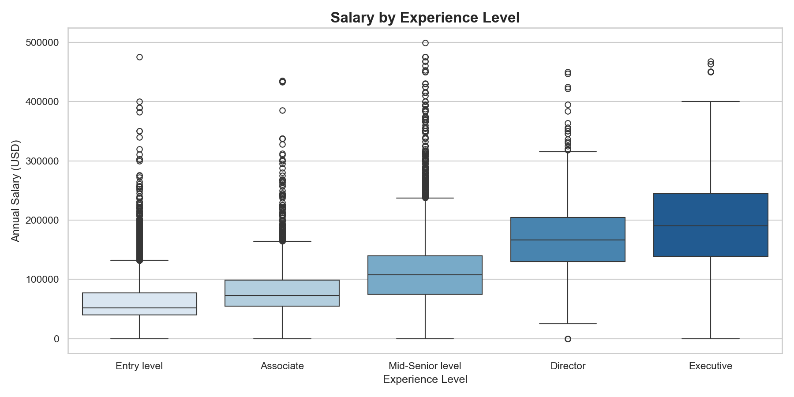

# LinkedIn Job Market Analysis 

## Overview
An end-to-end data analytics project analyzing **123,849 LinkedIn job postings** to uncover hiring trends, salary insights, and job market patterns across the United States.

## Business Questions Answered
1. Which states have the most job opportunities?
2. What are the most in-demand job titles?
3. What experience levels are companies hiring for?
4. How many jobs are remote-friendly?
5. What salaries can candidates expect?
6. How does salary grow with experience?

## Key Findings
- **California, Texas & New York** are the top 3 job markets
- **38.9% of jobs** are open to Entry Level candidates
- **Median salary** across all roles is $81,332
- Entry Level median salary is **$52,017** growing to **$190,000** at Executive level
- Only **12.1% of jobs** are fully remote

## Tools Used
- Python (Pandas, NumPy, Matplotlib, Seaborn)
- Jupyter Notebook
- Git & GitHub

## Charts

## Dataset
[LinkedIn Job Postings 2023-2024](https://www.kaggle.com/datasets/arshkon/linkedin-job-postings)
